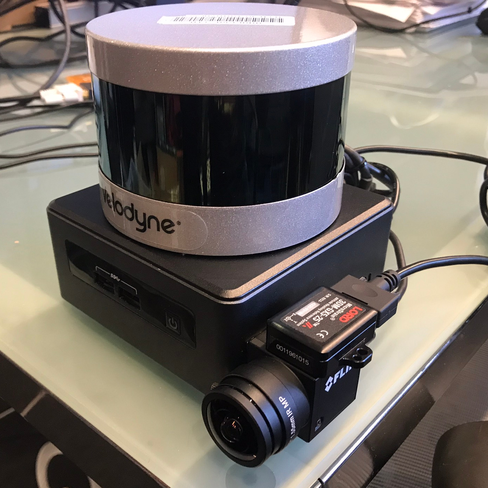
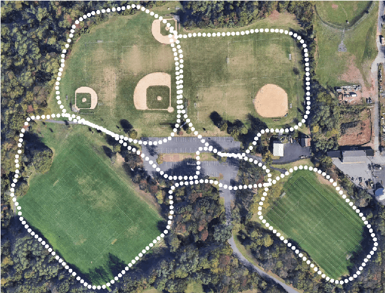

# LVI-SAM-Noted-savePose
modified from https://github.com/TixiaoShan/LVI-SAM
---
带中文注释的LVI-SAM，可保存优化后的雷达关键帧位姿，相机帧的时间戳，视觉里程计中提取到的每帧图像对应的关键点及其深度。

保存雷达位姿开关及路径设置在config/params_lidar.yaml中，会将位姿保存为tum格式的txt文件：
```
saveTXT: true                       
saveTXTDirectory: "/LVI_SAM_ws/data/"
```
保存相机时间戳及关键点设置在config/params_camera.yaml中，timestamp会保存在同一个txt文件中，关键点会保存在以各个图像对应的timestamp命名的txt文件中：
```
# Save camera timestamp
saveCameraTimestamp: 1
saveCameraTimestampDirectory: "/LVI_SAM_ws/data/"

# Save feature points and depth
saveFeaturePointsAndDepth: 1
saveFeaturePointsAndDepthDirectory: "/LVI_SAM_ws/data/featurePoints/"
```
---


This repository contains code for a lidar-visual-inertial odometry and mapping system, which combines the advantages of [LIO-SAM](https://github.com/TixiaoShan/LIO-SAM/tree/a246c960e3fca52b989abf888c8cf1fae25b7c25) and [Vins-Mono](https://github.com/HKUST-Aerial-Robotics/VINS-Mono) at a system level.

<p align='center'>
    
</p>

---

## Dependency

- [ROS](http://wiki.ros.org/ROS/Installation) (Tested with kinetic and melodic)
- [gtsam](https://github.com/borglab/gtsam/releases) (Georgia Tech Smoothing and Mapping library)
  ```
  wget -O ~/Downloads/gtsam.zip https://github.com/borglab/gtsam/archive/4.0.2.zip
  cd ~/Downloads/ && unzip gtsam.zip -d ~/Downloads/
  cd ~/Downloads/gtsam-4.0.2/
  mkdir build && cd build
  cmake -DGTSAM_BUILD_WITH_MARCH_NATIVE=OFF ..
  sudo make install -j4
  ```
- [Ceres](https://github.com/ceres-solver/ceres-solver/releases) (C++ library for modeling and solving large, complicated optimization problems)
  ```
  sudo apt-get install -y libgoogle-glog-dev
  sudo apt-get install -y libatlas-base-dev
  wget -O ~/Downloads/ceres.zip https://github.com/ceres-solver/ceres-solver/archive/1.14.0.zip
  cd ~/Downloads/ && unzip ceres.zip -d ~/Downloads/
  cd ~/Downloads/ceres-solver-1.14.0
  mkdir ceres-bin && cd ceres-bin
  cmake ..
  sudo make install -j4
  ```

---

## Compile

You can use the following commands to download and compile the package.

```
cd ~/catkin_ws/src
git clone https://github.com/TixiaoShan/LVI-SAM.git
cd ..
catkin_make
```

---

## Datasets

<p align='center'>
    
</p>

The datasets used in the paper can be downloaded from Google Drive. The data-gathering sensor suite includes: Velodyne VLP-16 lidar, FLIR BFS-U3-04S2M-CS camera, MicroStrain 3DM-GX5-25 IMU, and Reach RS+ GPS.

```
https://drive.google.com/drive/folders/1q2NZnsgNmezFemoxhHnrDnp1JV_bqrgV?usp=sharing
```

**Note** that the images in the provided bag files are in compressed format. So a decompression command is added at the last line of ```launch/module_sam.launch```. If your own bag records the raw image data, please comment this line out.

<p align='center'>
    
    
</p>

---

## Run the package

1. Configure parameters:

```
Configure sensor parameters in the .yaml files in the ```config``` folder.
```

2. Run the launch file:
```
roslaunch lvi_sam run.launch
```

3. Play existing bag files:
```
rosbag play handheld.bag 
```

---

## Paper 

Thank you for citing our [paper](./doc/paper.pdf) if you use any of this code or datasets.

```
@inproceedings{lvisam2021shan,
  title={LVI-SAM: Tightly-coupled Lidar-Visual-Inertial Odometry via Smoothing and Mapping},
  author={Shan, Tixiao and Englot, Brendan and Ratti, Carlo and Rus Daniela},
  booktitle={IEEE International Conference on Robotics and Automation (ICRA)},
  pages={to-be-added},
  year={2021},
  organization={IEEE}
}
```

---

## Acknowledgement

  - The visual-inertial odometry module is adapted from [Vins-Mono](https://github.com/HKUST-Aerial-Robotics/VINS-Mono).
  - The lidar-inertial odometry module is adapted from [LIO-SAM](https://github.com/TixiaoShan/LIO-SAM/tree/a246c960e3fca52b989abf888c8cf1fae25b7c25).